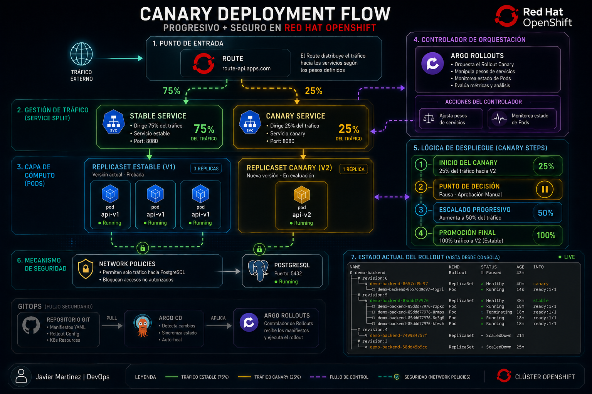

# 🚀 Nivel 03: Advanced Delivery (Argo Rollouts)

 
*Esquema visual del flujo de tráfico y despliegue progresivo implementado en este módulo.*

Este módulo representa la capa de **Despliegue Progresivo**. Aquí evolucionamos la infraestructura para utilizar estrategias de tipo **Canary**, permitiendo validar nuevas versiones con tráfico real antes de una promoción total.

## ⚠️ Prerrequisito Obligatorio

Para que estos manifiestos funcionen, es necesario tener instalado el controlador de **Argo Rollouts** en el clúster.
* **Guía oficial de instalación:** [https://argo-rollouts.readthedocs.io/en/stable/installation/](https://argo-rollouts.readthedocs.io/en/stable/installation/)

---

## 🛠️ ¿Qué implementamos en este nivel?

1.  **Recurso Rollout:** Sustituimos el `Deployment` tradicional por un `Rollout` de Argo.
2.  **Estrategia Canary:** El despliegue no es inmediato, sino que sigue pasos incrementales.
3.  **Service Split:** Se utilizan dos servicios para separar el tráfico:
    * `demo-backend`: Para la versión estable.
    * `demo-backend-canary`: Para la versión nueva (Canary).

## 📈 Flujo de Despliegue (Steps)

El Rollout está configurado para seguir este ciclo de vida:

1.  **Exposición Inicial (25%):** Se despliega la nueva versión y recibe el 25% del tráfico.
2.  **Pausa Manual:** El sistema se detiene indefinidamente esperando aprobación humana.
3.  **Escalado al 50%:** Tras la aprobación, se sube la carga al 50%.
4.  **Pausa Automática:** El sistema espera 1 minuto para verificar estabilidad.
5.  **Promoción Final:** Se completa el despliegue al 100% y se retira la versión vieja.

---

## 🕹️ Guía de Operaciones (CLI)

Podés gestionar el despliegue utilizando el plugin de `kubectl argo rollouts`:

### Ver estado en tiempo real
```bash
kubectl argo rollouts get rollout demo-backend -n demo --watch
```

### Aprobar el paso siguiente (Promote)
```bash
kubectl argo rollouts promote demo-backend -n demo
```

### Abortar y volver atrás (Rollback)
```bash
kubectl argo rollouts abort demo-backend -n demo
```

## 🏗️ Lógica de Control

Este nivel se apoya en el controlador de Rollouts para manipular dinámicamente los selectores de los Services. Esto garantiza que la Route de OpenShift distribuya las peticiones de forma precisa según los pesos definidos sin necesidad de cambios manuales en la red.